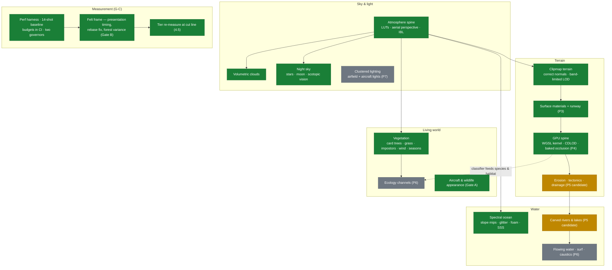

# fly high — Rendering Overhaul: Project Overview

**Status as of 2026-08-20.** Phases 0, 1, 2, 2.5, 3, **4** and the corrective **4.5** plus Gates B and A are complete — 239.55 of ≈358 priced effort-days shipped (~67% of the programme, and **past the v1 cut line at ≈224**). A **Phase 5 implementation candidate** now exists in the working tree, but it is not counted as shipped or phase-closed while its final GPU, visual, capture, rebaseline and timing evidence remains open. Phase 6 is next to plan.

Phase 4 closed nine of the audit's twelve root causes — and then flying the shipped tree found it failing all three goals from the pilot's seat, which is why the unplanned **Phase 4.5** exists ([`PHASE_4_5_EXECUTION_PLAN.md`](PHASE_4_5_EXECUTION_PLAN.md)). It absorbed Phase 4's four unclosed exit boxes and closed three of them: assertions 83b and 85 are written, and the sanctioned rebaseline and tier re-measure are taken. **Three items remain open** — `perf:capture` is not green (fps floors unmet on a hot laptop by the pre-change tree too, and deliberately not relaxed to fit it), the 20-consecutive-cold-loads check has not been re-run, and the three named flights are carried a third time. They are recordings, not code.

This document is the high-level view of the programme for readers outside the day-to-day work. The normative sources it summarises are [`RENDERING_PLAN.md`](RENDERING_PLAN.md) (the master plan), [`ARCHITECTURE.md`](ARCHITECTURE.md) (the enforced architectural contract), [`PRE_PHASE_4_REALIGNMENT.md`](PRE_PHASE_4_REALIGNMENT.md) (a binding mid-programme audit), and one execution plan per phase.

---

## 1. What fly high is

fly high is an original endless-flight simulator that runs in a browser. A deterministic, seeded world — terrain, forests, rivers, weather — is generated procedurally around the aircraft as it flies; there is no map data and no artist-authored content. A fixed-step 120 Hz six-degree-of-freedom flight model runs in a Web Worker; rendering is Babylon.js on **WebGPU exclusively** (no WebGL fallback), deployed both as a Cloudflare Worker app and as a static GitHub Pages build from the same client code.

## 2. Why the overhaul exists

A 2026 engine migration to WebGPU quietly regressed the world's appearance: the terrain audit ([`TERRAIN_AUDIT.md`](TERRAIN_AUDIT.md)) traced "the terrain doesn't look real" to twelve measured root causes — no surface material system at all, shading normals wrong by 24–35° at distance, no atmospheric perspective, no indirect light, a height field that structurally forbids rivers and erosion, and a performance governor that traded resolution away invisibly. The audit's deeper finding was institutional: the correct architecture had been specified in the repo and then shipped *dead*, with an ad-hoc path alongside it.

The overhaul is the programme that fixes this — not with quick patches, but by rebuilding the rendering stack in dependency order, with every claim measured and every architectural rule enforced by a failing test.

## 3. The three goals

Every phase is planned and certified against three user-stated goals (defined in `RENDERING_PLAN.md` §0.4):

| Goal | Statement | Test |
|---|---|---|
| **G-A** | Genuine, realistic graphics: clouds, water (and *where* water is), mountains, terrain surface, trees (and *where* trees are), all other foliage, **and the aircraft itself** | Every named element has a costed work item with exit criteria |
| **G-B** | Graphics align with **season and time of day** | Scrubbing the clock changes what the world looks like, not just where the sun is |
| **G-C** | **Medium settings run clean** — no flicker, lag or inconsistency — on a MacBook Pro | A measured number at the reference viewport, asserted in CI; "medium" = quality tier 1 |

A 2026-08-18 programme audit (`PRE_PHASE_4_REALIGNMENT.md`, amendments R-1…R-27) re-checked all ~316 then-planned days against these goals and found, among other things, that the aircraft — named explicitly in G-A — had **zero** appearance days anywhere in the plan, that the G-C performance instrument was measuring idle pacing rather than load, and that season and night were scheduled last and cut twice. The audit is binding over the other plan documents; it created Gate A (aircraft & wildlife), Gate 2Z (fix the measurement instrument first), and pulled the night sky (Gate 7A) forward by ~200 days.

## 4. How the programme works

- **Plans are verified against code before execution.** Each phase gets an execution plan whose factual claims (file/line, measured numbers) are checked against the tree before work starts; deviations discovered during implementation are logged, never silently absorbed.
- **Architecture is enforced, not documented.** `ARCHITECTURE.md` is normative; a single-owner manifest (`src/render/webgpu/owners.ts`) and a boundary test fail `npm test` if any artifact grows a second definition site or a forbidden import.
- **Performance is a measured number.** A deterministic 14-shot capture harness (`npm run perf:capture`) runs against committed baselines; frame and GPU-memory budgets are asserted per quality tier in CI. Baselines may only change at plan-sanctioned points.
- **Physics and rendering must agree.** The surface the aircraft touches and the surface on screen are produced by the same authority, held by invariant tests (e.g. runway collision = rendered earthworks within 1 mm).
- **Season is structural.** Rendering is driven by two continuous scalars — day-of-year and solar time — threaded into every seasonal function *from the moment it is written*, enforced by a boundary test.

## 5. Programme at a glance

```mermaid
flowchart LR
    subgraph done["✅ Complete (239.55 d shipped)"]
        direction LR
        P0["Phase 0<br/>Architecture shift<br/>16.8 d"] --> P1["Phase 1<br/>Foundation +<br/>atmosphere spine<br/>43.0 d"]
        P1 --> G2Z["Gate 2Z<br/>Measurement<br/>honesty<br/>6.0 d"]
        G2Z --> P2["Phase 2<br/>Clouds, water,<br/>living ground<br/>54.5 d"]
        P2 --> P25["Phase 2.5<br/>Night sky +<br/>veg. perf pass<br/>7.5 d"]
        P25 --> P3["Phase 3<br/>Terrain surface<br/>+ runway<br/>30.25 d"]
        P3 --> GB["Gate B<br/>The felt frame<br/>7.25 d"]
        GB --> GA["Gate A<br/>Aircraft +<br/>wildlife<br/>12.75 d"]
        GA --> P4["Phase 4<br/>Terrain GPU<br/>spine<br/>46.5 d"]
        P4 --> P45["Phase 4.5<br/>Run-the-app<br/>defects<br/>≈15 d"]
    end
    subgraph candidate["🟠 Implementation candidate — acceptance open"]
        direction LR
        P5["Phase 5<br/>Landscape evolution<br/>57.25 d planned"]
    end
    subgraph later["⚪ Planned — after the cut line"]
        direction LR
        P6["Phase 6<br/>Water in motion,<br/>ecology, tiers<br/>~27.0 d"]
        P6 --> P7["Phase 7<br/>Night ops +<br/>airfield identity<br/>34.0 d"]
    end
    P45 -->|"v1 cut line ≈ day 224, passed"| P5
    P5 --> P6
```

Day counts are the plan's effort-pricing currency (4.5 productive days/week in the original solo-calendar model); actual execution has run far faster in calendar terms. Reconciled ledger, 2026-08-20: **≈358 programme days, v1 cut line ≈224**. The rises are Phase 5 repriced 51.5 → 57.25, the 7.25-day Gate B, and Phase 4.5's ≈15 unplanned corrective days.

## 6. What has shipped

### Phase 0 — The architecture shift *(16.8 d, shipped 2026-08-17)*

Converted the specified architecture from prose into enforced code before any pixels changed:

- Single-owner manifest + boundary tests (every rendering artifact has exactly one definition site).
- One canonical terrain page geometry shared by present CPU tiles and the future GPU atlas.
- The physics/render consistency contract and its invariant tests.
- Kernel portability: the terrain noise kernel made bit-exactly transliterable to WGSL (for Phase 4).
- The continuous season/time clock (`dayOfYear`, `solarTimeHours`) replacing named presets.
- A GPU test harness (real WebGPU in headless Chromium) and a day-1 spike validating the terrain material/shadow approach the later phases rest on.

### Phase 1 — Foundation, correctness and the atmosphere spine *(43.0 d, shipped 2026-08-17)*

Made the renderer **measurable**, fixed the cheapest real errors, and built the atmosphere every material now shares. Closed 7 of the audit's 12 root causes.

- Per-pass GPU timing, fixed-seed screenshot baselines, CI-asserted frame/memory budgets.
- The two-governor adaptive quality system (resolution governor + CPU-work governor), replacing a one-way resolution ratchet; default render target cut from 5.94 to ≤1.5 Mpx.
- Correct terrain normals (24–35° errors gone; page generation 40.6 → ~8 ms) and band-limited height sampling (the crawling horizon stops).
- The visible tree lattice and placeholder villages removed; a continuous ecological density field with blue-noise scatter.
- **The atmosphere spine** — one physical scattering model (transmittance/multiple-scattering LUTs, closed-form aerial perspective) consumed by terrain, water, clouds, sky and every material; a physically-based sky with a real sun disc; image-based lighting; a single unified exposure; season-aware NOAA solar position; time-of-day and day-of-year as UI sliders.

### Gate 2Z + governor repair *(6.0 d, inside Phase 2's execution window)*

Fixed the instrument before 100+ days of pixel work: deterministic pinned-resolution captures (the old gate compared images that were 20.5% black), real GPU frame timing (the governor had been steering on a proxy), hitch metrics, per-shot season/time clocks, and honest GPU-memory budget rows.

### Phase 2 — Sky, sea surface and living ground *(54.5 d, closed 2026-08-19)*

The world's sky, water surface and vegetation rebuilt to read as real:

- **Volumetric clouds** — GPU-baked 3D noise volumes under a never-repeating weather field; multiple-scattering lighting with a real silver lining; distance-adaptive ray march; cloud shadows 7.5× sharper *and* cheaper.
- **Ocean surface** — slope mips with Toksvig roughness (the distant sea stops "boiling"), physically-derived sun glitter, lit advected foam, wave-crest subsurface scattering; the planar reflection pass retired in favour of the shared sky probe.
- **Vegetation** — the largest block: a procedural foliage atlas; card trees with real crowns, drawn trunks and translucent backlit glow; shrubs, rocks and forest-floor clutter; habitat-driven grass; three-band wind animation; hemi-octahedral impostors carrying the forest to the horizon; a compact 32-byte instance format; and a *rendered-density law* that prices every band of the forest against triangle and draw-call budgets.
- **Season, delivered early** — deciduous leaf-out/fall tint and shed, conifers holding, snowline whitening, impostors baked in two season buckets; snow decided by a seasonal temperature kernel.

### Phase 2.5 — Gate 7A (night) + the vegetation perf-debt pass *(7.5 d + debt pass, 2026-08-19)*

- **A real night sky**: an authored star catalogue (~190 real bright stars with true J2000 positions and colours plus a statistically correct generated background) under whole-sky sidereal rotation; an ephemeris moon with real phase geometry, opposition surge, earthshine and its own warm light; and a **scotopic vision** post-process reproducing human rod vision — colours desaturate, blues brighten, acuity drops, dark adaptation takes time. The ground is no longer black at 22:00.
- **Vegetation performance recovery**: −1,201 draw calls across the capture set (far-band impostors 7 meshes → 1 per chunk), GPU buffer pooling fixing a leak and a WebGPU buffer-lifetime hazard, and canopy-ranked thinning restoring measured forest cover (0.26 → 0.55) at the same budget.

### Phase 3 — Terrain surface and the runway *(30.25 d, shipped 2026-08-19)*

The audit's **#1 root cause closed**: the terrain had no surface material
system at all — every pixel of ground was an 8-bit colour interpolated from
the mesh's vertices, which past 5 km flipped between neighbours as often as
independent random draws.

- **Ten synthesised land-cover materials** — grass, dry grass, forest floor,
  shrub, sand, gravel, rock, snow, asphalt, concrete — in two GPU texture
  arrays, every layer carrying a full CPU-computed mip chain with a **Toksvig**
  term that folds a flattened normal map back into roughness. That term is what
  stops distant terrain acquiring a false sharp highlight, which is most of
  what "everything looks like plastic" actually is. Material resolution is now
  independent of mesh resolution — the structural fix the audit asks for.
- **One terrain surface plugin**, superseding the old one rather than
  neighbouring it: three decorrelated de-tiling scales, true triplanar
  projection on slopes with reoriented normal blending, height-based material
  blending, and per-material roughness, F0 and Oren-Nayar diffuse roughness.
  A wetness response is wired for Phase 6.
- **The runway rebuilt as earthworks the flight physics also sees.** A
  three-zone cut/fill profile with a 0.35 m camber replaces the circular
  plateau, and the collision fast path evaluates the *same* profile — held to
  within 1 mm by a new invariant test. The 28 coplanar boxes that used to float
  above the ground are gone; asphalt, rubber, worn markings and a ragged
  grass-invaded edge are painted into the terrain by the analytic airport SDF.
- **A seasonal ground palette** (`G-B`), anchored so midsummer is untouched,
  and the light rig's ground bounce derived from the surface system's own mean
  albedo — retiring two long-standing hand-tuned fakes.

Sixteen new assertions; one carried open (a per-pass GPU timer the renderer
does not yet have). Every deviation is recorded in
[`PHASE_3_EXECUTION_PLAN.md`](PHASE_3_EXECUTION_PLAN.md) §14.

## 7. Gates after Phase 3, and what's next

### Gate B — The felt frame *(7.25 d, shipped 2026-08-19)*

Created 2026-08-19 by [`PHASE_5_EXECUTION_PLAN.md`](PHASE_5_EXECUTION_PLAN.md) §15 from that day's flight-test reports ("choppy on anything but lowest settings; the plane constantly feels like it's shaking"; "too much foliage — forests are good, but there should be variance"). It landed before Gate A and Phase 4 so Phase 4's `4-10` re-measure starts from a stable presentation clock and honest forest pattern.

- **`B-0`** added start-to-start interval p95 and stopped pretending an asynchronous, uncorrelated GPU aggregate can produce a present-wait timer. The pre-gate nine-shot pacing/uncaptured envelope was 17.3–33.6 ms.
- **`B-1`** moved presentation onto snapshot simulation time with a worker-clock EMA, monotone sampling and ≤50 ms velocity/body-rate coasting; exterior camera position, aim, up and FOV now ease as one rig.
- **`B-4`** confirmed and fixed stale floating-origin chunks through immediate mesh compensation plus a matching pre-world shader offset, covered on a real adapter.
- **`B-2`** completed as a rejected experiment: all five core scenes regressed 0.78–2.09 ms GPU, so the merged alpha-test tree path was reverted and opaque trunks remain split. No ceiling was fraudulently re-pinned.
- **`B-3`** added real kilometre-scale meadow/forest provinces, below-render-cap glades, hard windthrow boundaries and shorter/bushier forest margins while leaving species/stand selection untouched.

**Honesty clause, carried from the plan:** Gate B does not close G-C. Near-ground frame debt still needs Phase 4 and Phase 6; Gate B fixed the shaking mechanisms and forest uniformity, and correctly refused a draw optimisation that lost on the adapter.

### Gate A — The things you look at *(12.75 d, shipped 2026-08-19)*

The trainer and jet now use lofted bodies and real airfoil volumes, synthesised mapped paint with panels/rivets/wear/livery, transmitted clearcoat glass and visible instrument panels. A continuous blade/disc crossfade replaces the propeller strobe, and cockpit camera layers keep every shadow caster live. Gull, hawk, deer and boar retain the shared thin-instance architecture but now have recognisable silhouettes and feather/fur/keratin materials.

### Phase 4 — The terrain GPU spine *(46.5 d, ✅ shipped 2026-08-20; the v1 cut line, ≈ day 224)*

The height kernel moved to the GPU with a measured physics-parity contract; 151–172 CPU-built terrain meshes became one GPU-fed CDLOD quadtree (`1 + shadowCascades` draw calls — 3 to 5 against a ceiling of 12 — no popping, 2 m near detail); baked occlusion lets distant ridges shadow valleys; a GPU land-cover classifier gives material identity a single authority, with the snowline migrating along a 24-bucket season cache. The CPU terrain path retired outright.

**What was measured.** Kernel parity is radius-INDEPENDENT: 3.78 mm at ±10⁴ m, 3.44 mm at ±10⁵ m and 2.37 mm at ±2.8×10⁶ m, against naive f32's 4.5 mm / 60 mm / 3.47 m — so the supported world radius is set by the lattice wrap, not by precision. The atlas agrees with the physics authority to 0.056 mm in height and 0.001° in normal at L0; the runway earthworks agree to 0.298 mm across platform, batter and untouched ground. Two adjacent occlusion pages, baked independently, agree to 14/255 across the shared edge — the global height pyramid doing its job.

Phase 4's close is the programme's stated "last defensible stopping point" for a v1.

### Phase 4.5 — Run-the-app defects at the G-C bar *(≈15 d, shipped 2026-08-20)*

An unplanned corrective phase, written after a 2026-08-20 investigation of the *running* app found the shipped Phase 4 tree failing all three goals from the pilot's seat: loads crashed, medium/balanced was choppy, and the terrain had visibly regressed into flat colour patches. Nine findings were handed to a second reader to refute; all nine came back confirmed, and everything outside that set is labelled single-reader confidence in the plan rather than quoted as measurement.

- **The crash was never a graphics-load problem** (`4.5-0`): a race between foliage batch growth and the shadow pass through a `ShadowDepthWrapper` cache poisoned by `resetDrawCache`. A validation guard fired 20 times in one load.
- **The splotches were a converged fixed point, not lag** (Gate 4.5-A): every capture reported 24–25 resident pages with none pending after up to 6,000 frames, because the breadth-first selector stalls the world at L5–L7 while the unconstrained criterion wants ≥2,300 nodes — raising the budget could never have fixed it. A global screen-space-error priority queue with a one-level neighbour clamp now reaches **L2 under the camera**, with bilinear splat sampling, a per-vertex provisional fallback, and the never-retry hole closed.
- **Streaming was starved by its own meter** (Gate 4.5-B): the real admission planner admitted 2 height pages per pump at full scale, 1 at governor rung 1 and **0 forever** at rung 2, while the lower-priority occlusion client still admitted two. `observeDispatchCostMs` had zero call sites. Now real per-dispatch costs, a floor of one, one budget plan per update, corridor re-ranking, and a fixed `setProfile` path that used to kill streaming silently for a whole session.
- **The felt frame** (Gate 4.5-C): vegetation shadow-casting off below tier 2, the startup hitch train removed (compute pre-warm plus the ten ~110 ms material syntheses moved to a worker), and per-pass GPU aggregates that make the frame gap inspectable.
- **Measured:** mean GPU p95 across the 16 shots 10.76 → 9.78 ms, and 14.02 → 12.38 ms across the ten vegetation-heavy ones, with a same-host pre-change control beside it. `VEGETATION_FRAME_DEBT_RATIO` re-pinned 5.57/5.01 → **3.28/2.87**; residency ceilings 196 → 88 from what the fixed selector actually produces.

**What it does not claim.** fps is not settled: re-running the *pre-4.5* tree back-to-back on the same host reported 16.5 fps against the 20.3 pinned four hours earlier, so the machine moved the number 19% on its own. Every counter moved the right way; the G-C verdict needs an idle reference machine.

### Phase 5 — Landscape evolution *(57.25 d planned; implementation candidate 2026-08-20; acceptance open)*

The candidate makes `worldEvolution: "eroded"` the default and keeps explicit `"analytic"` compatibility. A world-anchored, cell-centred 1024² macro authority computes drainage, lake spills and channel seeds off the main thread; bounded page evolution adds the fine terrain through a fixed 64-texel halo; the tectonic uplift uses a turning double-angle fabric and closes the fine spectral gap; the height ceiling is 4,500 m. Completed L0 pages and the macro grid feed the simulation worker's L0 → macro → analytic recovery ladder, so a quality tier cannot change the collision surface.

The same canonical export now drives a deterministic channel graph, graph-backed inland-water geometry, two-level bathymetry and depth-aware water shading. Per-page flow/lake/soil/shore fields share atomic residency: flow/TWI feeds the land-cover classifier, and signed shore distance is published through the bounded detail authority and worker into the live riparian-density path; lake and soil remain exposed future inputs. The debug overlay exposes macro flow, lakes, base levels, fabric and erodibility.

This is deliberately an **implementation candidate**, not a Phase-5 close. The erosion producers are deterministic CPU-worker references behind the intended client/runtime boundaries, not the plan's final measured GPU passes; page work is one-at-a-time and seeds directly from the macro instead of a resident-parent chain; bathymetry samples the macro authority rather than overlaying resident L0 pages. The broad seeded tectonic field is not yet the planned plate-motion/rift/hotspot model, and fine bands lack the planned post-erosion soil/curvature mask. Production does protect the runway earthworks and applies strictly-downhill acyclic perimeter drainage. Analytic compatibility retains the historical carve proxies and tracer. One local production-shape CPU run measured 7,497 ms for macro sampling plus evolution, missing the 1.5 s load target; it is not reference-machine/GPU acceptance. No measured per-page cost, sanctioned rebaseline, named visual flight, new capture shot, or final GPU acceptance result is claimed. The exact deviations and remaining gates are recorded in [`PHASE_5_EXECUTION_PLAN.md`](PHASE_5_EXECUTION_PLAN.md) §14.1.

### Phase 6 — Water in motion, ecology and final tiers *(~27.0 d, planned — **planning is the next planning task**)*

Flowing rivers, surf with run-up and wet sand, caustics and wetness; ecology channels (riparian corridors, soil, shelter) driving where plants and animals live; GPU vegetation scatter; quality tiers re-certified on measured numbers.

### Phase 7 — Night operations and airfield identity *(34.0 d remaining, planned)*

A clustered lighting engine and ~200 instanced light points; complete airfield lighting from the airport definition (including a PAPI accurate to 0.1°); aircraft nav/strobe/landing lights; parametric hangars and airfield furniture replacing the last placeholder boxes.

## 8. Goal coverage today

| Goal element | State |
|---|---|
| Clouds | ✅ shipped (Phase 2) |
| Water surface | ✅ shipped (Phase 2) |
| Water *placement* (rivers/lakes where water collects) | 🟠 Phase 5 implementation candidate; visual/capture acceptance open |
| Mountains (real erosion-formed shape) | 🟠 Phase 5 implementation candidate; final GPU/performance/visual acceptance open |
| Terrain surface materials | ✅ shipped (Phase 3); ✅ one classifier authority (Phase 4 `4-6`, `R-27`); ✅ the Phase 4 splotch regression fixed (Phase 4.5 Gate A) |
| Trees & foliage appearance | ✅ shipped (Phase 2/2.5) |
| Tree *placement* (ecological) | ✅ field shipped (Phase 1); deepens in Phase 6 |
| The aircraft | ✅ shipped (Gate A) |
| **G-B** sun path / seasons / night | ✅ sun + seasons + night sky + ground palette + classified snowline (24-bucket season cache, cross-faded) |
| **G-C** measured performance | Instrument ✅ (Gate 2Z); budgets in CI ✅; compute budget ENFORCED ✅ (`4-0b`); tier table measured and committed ✅ (Phase 4.5); **but the verdict is not in** — `perf:capture` fps floors are unmet on the capture host by the pre-change tree as well, so the number needs an idle reference machine, and `6-11` owns the re-tier |

## 9. Open items carried honestly

- **Three Phase 4.5 exit boxes are still open.** `perf:capture` is not green — `approach-500ft` measures 19.1 fps against a committed floor of 24, and the pre-change control measures 20.9 on the same host, so the floor is unmet by *both* trees; the floors were deliberately left where they are rather than relaxed to fit a hot laptop. The 20-consecutive-cold-loads check is mechanism-covered by assertions but has not been re-run. And the three named flights are carried a third time — they are recordings, and nothing in code can produce them.
- **The capture host's thermal state is an uncontrolled variable.** The same commit reported 20.3 fps / 6 hitches and 18.5 fps / 117 four hours apart, and a clean pre-4.5 worktree read 16.5 fps / 232 back-to-back against the 20.3 pinned earlier. Any fps delta smaller than ~19% is unmeasured on this machine, and no item owns making it controlled.
- **Half the frame is invisible to both timers.** ~10 ms GPU p95 against a ~70 ms interval p95. Phase 4.5's per-pass aggregates confirm it is neither the shadow pass nor terrain compute; naming it needs the frame-correlatable timestamp source `B-0` specified and no plan owns.
- **Vegetation frame debt — reduced, not closed.** `VEGETATION_FRAME_DEBT_RATIO` is re-pinned 5.57/5.01 → 3.28/2.87 after the shadow-cast knob, and Gate B's crown+trunk merge stays measured-and-rejected. Phase 6's GPU scatter (`6-9`) and re-tiering (`6-11`) own the structural fix.
- **A height page costs ~1.9 ms of GPU** against a 0.7 ms tier-1 row — recorded by Phase 4.5 as an input to Phases 5 and 6: the compute rows are not reachable for this client at any tier, and the floor of one is currently terrain's only admission path.
- **Phase 5 is not closed by code existence.** Its live candidate uses CPU workers for macro/page erosion, admits one page at a time, seeds from macro rather than a resident-parent chain, and gives bathymetry macro rather than L0 page authority. Planned plates/rifts/hotspots and post-erosion fine-band masking remain gaps; runway exclusion and strictly-downhill acyclic perimeter diversion are live. The evolution debug views exist. A local CPU macro run took 7,497 ms and therefore misses the 1.5 s target; final-GPU/reference-machine load timing, measured per-page cost, named flights, new capture shots, sanctioned rebaselines and full acceptance commands do not have recorded evidence yet.
- **Two open decisions (R-16)** the season epoch rests on: does the clock advance in flight, and does precipitation get a renderer.
- **Plan hygiene at hand-off.** The Phase 5 implementation record now reconciles the live architecture with the plan; historical line citations still describe the tree against which the plan was written and must not be treated as current source locations.
- **fps floors are machine-specific.** Committed capture floors bind on the reference machine only; draw calls, triangles and batch counts are the portable cross-machine counters.

## 10. Renderer systems map

**Legend:** green = shipped · amber = implementation candidate with acceptance open · blue = planned before the v1 cut line · grey = planned after the cut line.

---

*Maintained alongside the phase execution plans; update at each phase close. Sources: `RENDERING_PLAN.md`, `PRE_PHASE_4_REALIGNMENT.md` §9 (ledger), `ARCHITECTURE.md` (decision log), phase execution plans §13 (deviations).*
