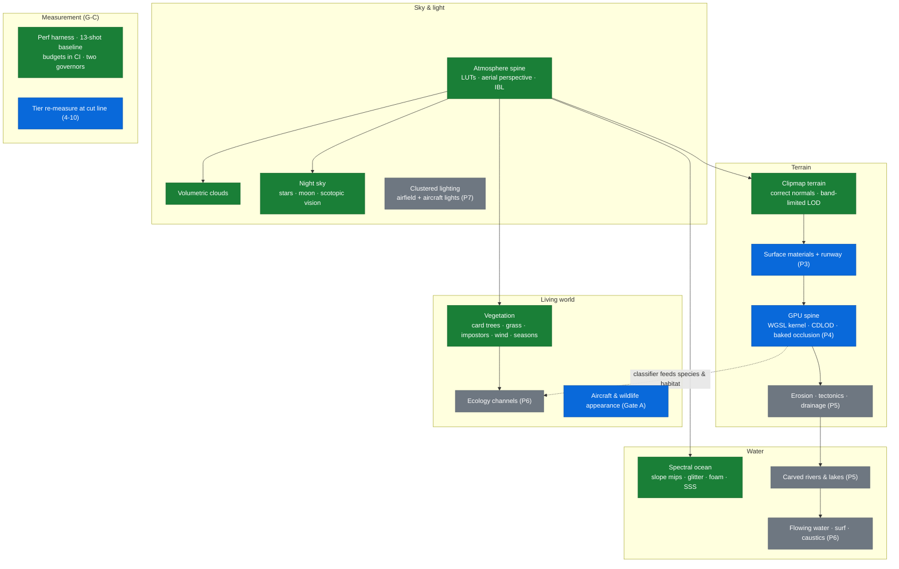

# fly high — Rendering Overhaul: Project Overview

**Status as of 2026-08-19.** Phases 0, 1, 2 and 2.5 are complete — 127.8 of ≈330 priced effort-days shipped (~39% of the programme, ~59% of the way to the v1 cut line). Phase 3 (terrain surface and the runway) is next to implement; Phase 5 (landscape evolution) is next to plan.

This document is the high-level view of the programme for readers outside the day-to-day work. The normative sources it summarises are [`RENDERING_PLAN.md`](RENDERING_PLAN.md) (the master plan), [`ARCHITECTURE.md`](ARCHITECTURE.md) (the enforced architectural contract), [`PRE_PHASE_4_REALIGNMENT.md`](PRE_PHASE_4_REALIGNMENT.md) (a binding mid-programme audit), and one execution plan per phase.

---

## 1. What fly high is

fly high is an original endless-flight simulator that runs in a browser. A deterministic, seeded world — terrain, forests, rivers, weather — is generated procedurally around the aircraft as it flies; there is no map data and no artist-authored content. A fixed-step 120 Hz six-degree-of-freedom flight model runs in a Web Worker; rendering is Babylon.js on **WebGPU exclusively** (no WebGL fallback), deployed both as a Cloudflare Worker app and as a static GitHub Pages build from the same client code.

## 2. Why the overhaul exists

A 2026 engine migration to WebGPU quietly regressed the world's appearance: the terrain audit ([`TERRAIN_AUDIT.md`](TERRAIN_AUDIT.md)) traced "the terrain doesn't look real" to twelve measured root causes — no surface material system at all, shading normals wrong by 24–35° at distance, no atmospheric perspective, no indirect light, a height field that structurally forbids rivers and erosion, and a performance governor that traded resolution away invisibly. The audit's deeper finding was institutional: the correct architecture had been specified in the repo and then shipped *dead*, with an ad-hoc path alongside it.

The overhaul is the programme that fixes this — not with quick patches, but by rebuilding the rendering stack in dependency order, with every claim measured and every architectural rule enforced by a failing test.

## 3. The three goals

Every phase is planned and certified against three user-stated goals (defined in `RENDERING_PLAN.md` §0.4):

| Goal | Statement | Test |
|---|---|---|
| **G-A** | Genuine, realistic graphics: clouds, water (and *where* water is), mountains, terrain surface, trees (and *where* trees are), all other foliage, **and the aircraft itself** | Every named element has a costed work item with exit criteria |
| **G-B** | Graphics align with **season and time of day** | Scrubbing the clock changes what the world looks like, not just where the sun is |
| **G-C** | **Medium settings run clean** — no flicker, lag or inconsistency — on a MacBook Pro | A measured number at the reference viewport, asserted in CI; "medium" = quality tier 1 |

A 2026-08-18 programme audit (`PRE_PHASE_4_REALIGNMENT.md`, amendments R-1…R-27) re-checked all ~316 then-planned days against these goals and found, among other things, that the aircraft — named explicitly in G-A — had **zero** appearance days anywhere in the plan, that the G-C performance instrument was measuring idle pacing rather than load, and that season and night were scheduled last and cut twice. The audit is binding over the other plan documents; it created Gate A (aircraft & wildlife), Gate 2Z (fix the measurement instrument first), and pulled the night sky (Gate 7A) forward by ~200 days.

## 4. How the programme works

- **Plans are verified against code before execution.** Each phase gets an execution plan whose factual claims (file/line, measured numbers) are checked against the tree before work starts; deviations discovered during implementation are logged, never silently absorbed.
- **Architecture is enforced, not documented.** `ARCHITECTURE.md` is normative; a single-owner manifest (`src/render/webgpu/owners.ts`) and a boundary test fail `npm test` if any artifact grows a second definition site or a forbidden import.
- **Performance is a measured number.** A deterministic 13-shot capture harness (`npm run perf:capture`) runs against committed baselines; frame and GPU-memory budgets are asserted per quality tier in CI. Baselines may only change at plan-sanctioned points.
- **Physics and rendering must agree.** The surface the aircraft touches and the surface on screen are produced by the same authority, held by invariant tests (e.g. runway collision = rendered earthworks within 1 mm).
- **Season is structural.** Rendering is driven by two continuous scalars — day-of-year and solar time — threaded into every seasonal function *from the moment it is written*, enforced by a boundary test.

## 5. Programme at a glance

```mermaid
flowchart LR
    subgraph done["✅ Complete (127.8 d shipped)"]
        direction LR
        P0["Phase 0<br/>Architecture shift<br/>16.8 d"] --> P1["Phase 1<br/>Foundation +<br/>atmosphere spine<br/>43.0 d"]
        P1 --> G2Z["Gate 2Z<br/>Measurement<br/>honesty<br/>6.0 d"]
        G2Z --> P2["Phase 2<br/>Clouds, water,<br/>living ground<br/>54.5 d"]
        P2 --> P25["Phase 2.5<br/>Night sky +<br/>veg. perf pass<br/>7.5 d"]
    end
    subgraph next["🔵 Planned — next up"]
        direction LR
        P3["Phase 3<br/>Terrain surface<br/>+ runway<br/>30.25 d"] --> GA["Gate A<br/>Aircraft +<br/>wildlife<br/>12.75 d"]
        GA --> P4["Phase 4<br/>Terrain GPU<br/>spine<br/>46.5 d"]
    end
    subgraph later["⚪ Planned — after the cut line"]
        direction LR
        P5["Phase 5<br/>Landscape<br/>evolution<br/>51.5 d"] --> P6["Phase 6<br/>Water in motion,<br/>ecology, tiers<br/>~27.5 d"]
        P6 --> P7["Phase 7<br/>Night ops +<br/>airfield identity<br/>34.0 d"]
    end
    P25 --> P3
    P4 -->|"v1 cut line ≈ day 217"| P5
```

Day counts are the plan's effort-pricing currency (4.5 productive days/week in the original solo-calendar model); actual execution has run far faster in calendar terms. Reconciled ledger, 2026-08-19: **≈330 programme days, v1 cut line ≈217** (a defensible v1 exists after Phase 4).

## 6. What has shipped

### Phase 0 — The architecture shift *(16.8 d, shipped 2026-08-17)*

Converted the specified architecture from prose into enforced code before any pixels changed:

- Single-owner manifest + boundary tests (every rendering artifact has exactly one definition site).
- One canonical terrain page geometry shared by present CPU tiles and the future GPU atlas.
- The physics/render consistency contract and its invariant tests.
- Kernel portability: the terrain noise kernel made bit-exactly transliterable to WGSL (for Phase 4).
- The continuous season/time clock (`dayOfYear`, `solarTimeHours`) replacing named presets.
- A GPU test harness (real WebGPU in headless Chromium) and a day-1 spike validating the terrain material/shadow approach the later phases rest on.

### Phase 1 — Foundation, correctness and the atmosphere spine *(43.0 d, shipped 2026-08-17)*

Made the renderer **measurable**, fixed the cheapest real errors, and built the atmosphere every material now shares. Closed 7 of the audit's 12 root causes.

- Per-pass GPU timing, fixed-seed screenshot baselines, CI-asserted frame/memory budgets.
- The two-governor adaptive quality system (resolution governor + CPU-work governor), replacing a one-way resolution ratchet; default render target cut from 5.94 to ≤1.5 Mpx.
- Correct terrain normals (24–35° errors gone; page generation 40.6 → ~8 ms) and band-limited height sampling (the crawling horizon stops).
- The visible tree lattice and placeholder villages removed; a continuous ecological density field with blue-noise scatter.
- **The atmosphere spine** — one physical scattering model (transmittance/multiple-scattering LUTs, closed-form aerial perspective) consumed by terrain, water, clouds, sky and every material; a physically-based sky with a real sun disc; image-based lighting; a single unified exposure; season-aware NOAA solar position; time-of-day and day-of-year as UI sliders.

### Gate 2Z + governor repair *(6.0 d, inside Phase 2's execution window)*

Fixed the instrument before 100+ days of pixel work: deterministic pinned-resolution captures (the old gate compared images that were 20.5% black), real GPU frame timing (the governor had been steering on a proxy), hitch metrics, per-shot season/time clocks, and honest GPU-memory budget rows.

### Phase 2 — Sky, sea surface and living ground *(54.5 d, closed 2026-08-19)*

The world's sky, water surface and vegetation rebuilt to read as real:

- **Volumetric clouds** — GPU-baked 3D noise volumes under a never-repeating weather field; multiple-scattering lighting with a real silver lining; distance-adaptive ray march; cloud shadows 7.5× sharper *and* cheaper.
- **Ocean surface** — slope mips with Toksvig roughness (the distant sea stops "boiling"), physically-derived sun glitter, lit advected foam, wave-crest subsurface scattering; the planar reflection pass retired in favour of the shared sky probe.
- **Vegetation** — the largest block: a procedural foliage atlas; card trees with real crowns, drawn trunks and translucent backlit glow; shrubs, rocks and forest-floor clutter; habitat-driven grass; three-band wind animation; hemi-octahedral impostors carrying the forest to the horizon; a compact 32-byte instance format; and a *rendered-density law* that prices every band of the forest against triangle and draw-call budgets.
- **Season, delivered early** — deciduous leaf-out/fall tint and shed, conifers holding, snowline whitening, impostors baked in two season buckets; snow decided by a seasonal temperature kernel.

### Phase 2.5 — Gate 7A (night) + the vegetation perf-debt pass *(7.5 d + debt pass, 2026-08-19)*

- **A real night sky**: an authored star catalogue (~190 real bright stars with true J2000 positions and colours plus a statistically correct generated background) under whole-sky sidereal rotation; an ephemeris moon with real phase geometry, opposition surge, earthshine and its own warm light; and a **scotopic vision** post-process reproducing human rod vision — colours desaturate, blues brighten, acuity drops, dark adaptation takes time. The ground is no longer black at 22:00.
- **Vegetation performance recovery**: −1,201 draw calls across the capture set (far-band impostors 7 meshes → 1 per chunk), GPU buffer pooling fixing a leak and a WebGPU buffer-lifetime hazard, and canopy-ranked thinning restoring measured forest cover (0.26 → 0.55) at the same budget.

## 7. What's next

### Phase 3 — Terrain surface and the runway *(30.25 d, planned — implementation next)*

Closes the audit's #1 root cause: the ground gets a real material system.

- Ten procedurally synthesised land-cover materials (grass, rock, scree, sand, snow, asphalt…) in GPU texture arrays with anti-shimmer mip discipline.
- One terrain surface plugin: three-scale de-tiling, true triplanar projection on slopes, height-based material blending, per-material BRDF (the "nothing looks like plastic" fix).
- The runway rebuilt as real cut/fill **earthworks the flight physics also sees** (1 mm render/collision invariant), with worn asphalt, faded markings and skid marks painted by an analytic SDF.
- Seasonal ground palette — scheduled immediately after the plugin so G-B isn't hostage to a slip.

### Gate A — The things you look at *(12.75 d, planned, after Phase 3)*

The aircraft finally gets its appearance: lofted fuselage and real wing sections, synthesised paint with panel lines and wear, glass cockpit with a visible instrument panel, propeller-disc and shadow fixes — plus wildlife silhouettes and materials replacing unit spheres.

### Phase 4 — The terrain GPU spine *(46.5 d, planned; v1 cut line at its close, ≈ day 217)*

The height kernel moves to the GPU with a measured physics-parity contract; 172 CPU-built terrain meshes become one GPU-fed CDLOD quadtree (≤12 draw calls, no popping, 2 m near detail); baked occlusion lets distant ridges shadow valleys; a GPU land-cover classifier gives material identity a single authority — with the snowline migrating along a 24-bucket season cache. The CPU terrain path retires. Phase 4's close is the programme's stated "last defensible stopping point" for a v1.

### Phase 5 — Landscape evolution *(51.5 d, planned — **planning is the next planning task**)*

The single largest realism change and the highest schedule risk: GPU erosion and macro drainage give the world real valleys, ridge networks, rivers and lakes *where water actually collects*; a tectonic skeleton replaces the global 35° grain; the terrain ceiling rises to 4,500 m; physics reads the eroded surface through a readback contract.

### Phase 6 — Water in motion, ecology and final tiers *(~27.5 d, planned)*

Flowing rivers, surf with run-up and wet sand, caustics and wetness; ecology channels (riparian corridors, soil, shelter) driving where plants and animals live; GPU vegetation scatter; quality tiers re-certified on measured numbers.

### Phase 7 — Night operations and airfield identity *(34.0 d remaining, planned)*

A clustered lighting engine and ~200 instanced light points; complete airfield lighting from the airport definition (including a PAPI accurate to 0.1°); aircraft nav/strobe/landing lights; parametric hangars and airfield furniture replacing the last placeholder boxes.

## 8. Goal coverage today

| Goal element | State |
|---|---|
| Clouds | ✅ shipped (Phase 2) |
| Water surface | ✅ shipped (Phase 2) |
| Water *placement* (rivers/lakes where water collects) | Phase 5 |
| Mountains (real erosion-formed shape) | Phase 5 |
| Terrain surface materials | Phase 3 → Phase 4 |
| Trees & foliage appearance | ✅ shipped (Phase 2/2.5) |
| Tree *placement* (ecological) | ✅ field shipped (Phase 1); deepens in Phase 6 |
| The aircraft | Gate A (after Phase 3) |
| **G-B** sun path / seasons / night | ✅ sun+seasons+night sky shipped; ground palette Phase 3, classified snowline Phase 4 |
| **G-C** measured performance | Instrument ✅ (Gate 2Z); budgets in CI ✅; open vegetation frame debt (below); binding tier evidence lands at Phase 4's `4-10` |

## 9. Open items carried honestly

- **Vegetation frame debt.** The 1.8 ms vegetation budget row is ~5× over at tier 1 in near-field forest shots. A dedicated pass (Phase 2.5) removed 1,201 draw calls and priced the residual in code (`VEGETATION_DRAW_CEILING`, `VEGETATION_FRAME_DEBT_RATIO`); the next rung (crown+trunk mesh merge, 347 → 186 draws) is costed but unshipped. Scheduled before Phase 4's G-C gate.
- **Two open decisions (R-16)** before Phase 4 designs the season epoch: does the clock advance in flight, and does precipitation get a renderer.
- **Plan hygiene at hand-off.** Phase 3/4 execution plans were verified against the Phase-1 tree; their line-number citations must be re-derived against the current tree before implementation (their own stated rule).
- **fps floors are machine-specific.** Committed capture floors bind on the reference machine only; draw calls, triangles and batch counts are the portable counters.

## 10. Renderer systems map

**Legend:** green = shipped · blue = planned, before the v1 cut line · grey = planned, after the cut line.

---

*Maintained alongside the phase execution plans; update at each phase close. Sources: `RENDERING_PLAN.md`, `PRE_PHASE_4_REALIGNMENT.md` §9 (ledger), `ARCHITECTURE.md` (decision log), phase execution plans §13 (deviations).*
